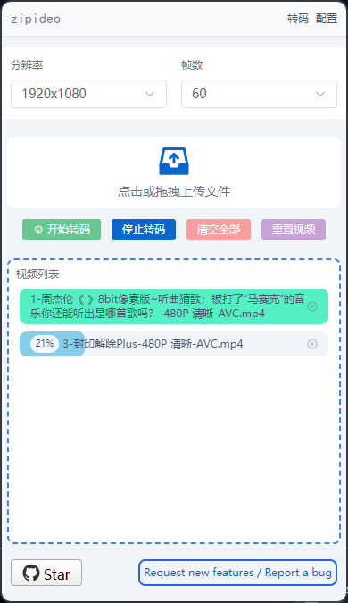

# 视频压缩电脑桌面端软件
<p align="center">
  <br>
  <p align="center" style="font-size: 2em; font-weight: bold;">zipideo</p>
  <br>
</p>
  <p align="center">
    <a href="#">调试</a> •
    <a href="#">构建</a>
  </p>
  <p align="center">
    
    
    
    
    
  </p>

### 📫 功能介绍

> 版本：v1.0.9（✅ 已发布）

- [x] 压缩过程主要是对视频文件的分辨率和帧数进行修改达到压缩的效果
- [x] 分辨率、帧数和视频保存目录可以自定义进行配置并持久化保存
- [x] 拖拽上传视频文件或单选、多选视频文件进行压缩
- [x] 压缩完成之后，将文件保存到视频保存目录下，不覆盖原视频文件
- [x] 压缩进度展示
- [x] 打包成Mac和Window程序
- [x] 提供自动更新和手动更新应用的功能，自动更新的同时展示安装包下载进度，优化用户体验

---

### 🍀 效果展示



---

### 🏅 软件下载
你可以从 [Github](https://github.com/aaaaa-pi/zipideo/releases)  下载软件。
<br>
你也可以 clone 项目后，在本地根据自行编译软件使用，请进入项目根目录执行以下命令，或者在项目的 package.json 文件中看到更多命令。

---

### 🛠 开发与调试
```bash
# 安装依赖包
$ pnpm install

# Window系统编译命令
$ pnpm build:win

# Mac系统编译命令
$ pnpm build:mac
$ pnpm build:mac-arm
$ pnpm build:mac-mas

# Linux系统编译命令
$ pnpm build:linux
```
electron 编译失败或者是速度慢，一般可以设置一下 electron 或 electron-build 镜像进行解决
